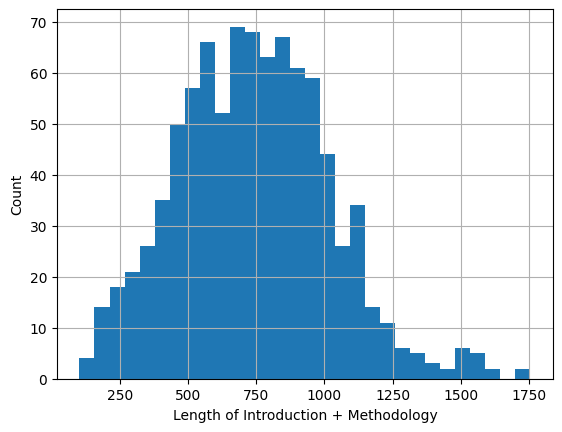

<h1 align="center">🤖 A Medical-Research Specific Research Method Querying System Trained with LoRA </h1>

<!--  -->

 

👉 CSE 587: Deep Learning for NLP - Final Project (Spring 2025)

👉 **Contributors**: `Sinjoy Saha`, `Xin Dong`

👉 Read the full report [here](/CSE_587_Final_Project_Report.pdf).

## 🔍Table of Contents

- [🔍Table of Contents](#table-of-contents)
- [Dataset Curation](#dataset-curation)
  - [Dataset Distribution](#dataset-distribution)
- [Results](#results)
  - [Training Plots](#training-plots)
  - [Evaluation Metrics](#evaluation-metrics)
  - [Example](#example)

## Dataset Curation

        

For this study, we use the PubMedQA dataset [1], a biomedical question-answering corpus constructed from PubMed abstracts. It comprises three subsets: PQA-L (expert-labeled), PQA-A (automatically generated), and PQA-U (unlabeled). We utilize the PQA-L subset, which includes 1,000 high-quality expert-annotated samples. Each sample contains a research question derived from a biomedical article title, along with a long answer corresponding to the article’s conclusion. Although originally intended for QA classification, the long answer often includes methodological insights and outcome summaries. This makes the dataset well-suited for instruction tuning of large language models
(LLMs) to generate research methodologies conditioned on biomedical research questions.

To prepare the dataset for our task, we apply the following pre-processing steps:
- **Filtering**: Instances with missing/empty long answers are excluded to ensure complete outputs. Samples lacking details like either "objective" and "background context" or "Methodology" content are removed.
- **Instruction Formatting**: Each input is reformatted into an instruction-style prompt containing: 
  
    1) "Research Question"—the central inquiry driving the study; 
    2) "Introduction" that outlines the study’s "objective" and "background context" details; and 
    3) "Methodology"—the primary methodology or approach used. Additional details such as "participants", "settings", or "datasets" are intentionally omitted to maintain consistency, as these elements are not uniformly available across all papers. This approach ensures standardized prompts that focus exclusively on the core components present in every study.
- **Tokenizing**: Prompts and responses are tokenized using the tokenizer corresponding to the base language model, with a maximum sequence length of 512 tokens. Padding and truncation are applied as necessary.
- **Train-Test Splitting**: We reserve 20 percent of the data for testing and 80 percent of the data for training. Each example is formatted as an instruction–response pair, where the input is a research question, and the output is the corresponding methodological description.

### Dataset Distribution

## Results

### Training Plots

### Evaluation Metrics

- **BLEU** (Bilingual Evaluation Understudy) Score: Measures the n-gram overlap between the generated method (including methodology and others) and the ground-truth texts in the test set, focusing on precision.
- **ROUGE** (Recall-Oriented Understudy for Gisting Evaluation) Score: Evaluates the quality of the generated text by computing recall-based overlap with the ground-truth texts.
- **BERT Score**: Measured the cosine similarity between generated- and ground-truth- texts, leveraging pretrained contextual embeddings from BERT.

### Example

